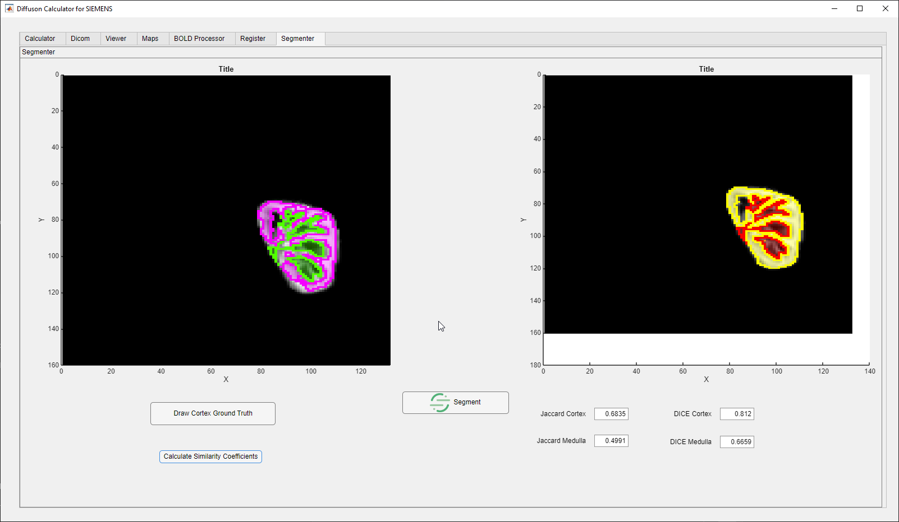

# Diffusion-Calculator
Executable for Latest Version Download Link:https://drive.google.com/file/d/1an0g2nTdxhH4tO7LH9vIaaHSuZZhV5pb/view?usp=drive_link

Diffusion Calculator is for Calculation IVIM and ADC parameters from DWI-MRI images designed for renal sequences but also can bu used other sections. Designed and coded using images from SIEMENS vendor MRI.

Opening Tab and Load DICOM:
-Use Load DICOM button on bottom right in Calculator TAB for importing DICOM series. You can import multiple DICOM series at once. When Loading is finished you can see a warning on bottom left.

You can see your DICOM Collection on DICOM TAB

1-Preview Window
2-Frame Count and Acquisiton Date
3-Patient List
4-Sequence List
5-Save and Load Database Buttons
6-Routing Buttons

-Viewer:
--You can load any sequence on Viewer Tab by "Load to Viewer" button in "DICOM" tab.You can traveling along instances and adjusting contrast and brightness via lateral sliders and changing color palette with colormap selection.

1-Instance Slider
2-Brightness Slider
3-Contrast Slider
4-Colormap Menu

-Maps:
-- You can visulaze parametric maps after calculating IVIM and Diffusion parameters 

-BOLD Processor:
--You can use BOLD(R2*) Processor for recalculate R2* images from multi TE Series you can monitor the oxygenization from these Series. In this tab you are allowed to draw ROI on desired locations and can calculate and visualize R2* value and map.

Then You can calculate IVIM and ADC parameters via just pressing the calculate button.
2 Algorithm is included for IVIM free-fit and Segmented-fit. You can select the algorithms from radio buttons. After Calculation will be completed you can see all parameters and fitting curve.If you use all algorithms you can generate maps for specific regions.

-Register:
--You can register 2 images from the same patient in Register tab. You can use either whole image or segmented locations for registering. Select and load desired sequences for fixed and moving image. After that for segmentation you cand draw ROI for segmentation location. Med-SAM inference will segment the desired organs. Do the same for moving image then select the segments via "fixed segment" and "moving segments buttons for registration.
--You can use "show pair" button tu visualize corresponding segments at spatial domain. Click "segment guided registration" and visualize registered image and fixed image.You can also send registerd image to segmenter for furhter segmentation.

1-Drawed ROI

-Segmenter:
--You can segment registerd image for delineate brighter and darker regions. After segmentation you can draw ground truth for bright areas and can calculate jaccard and DICE indexes.

-Calculator:
-You can visualize IVIM images at "Calculator" tab.Either with slice locations or b-value you can  travel along images with corresponding instance or b-value. You can use medulla(dark areas) or cortex(bright areas) segments if you have done segmentation via " Segmenter". Despite segmenter was used, You can freely draw ROIs on desired image.
--Single ROI drawing can be done in 4 different shapes(Rectangle,Polygon,Freehand,Assisted Freehand). Click on draw ROI and draw your shape on desired location. Signal decay curve display immediatley after ROI is finished.
--For Drawing Multi ROIs click on " Draw Multiple ROI" and ROI drawing process starts. When you finish drawing ROIs click on switch under the "Draw Multiple ROI" button and little blue dot appears in image down-right corner. Click on this dot your ROI has been drawed.
--After Drawing ROIs select the algorithm under the options section and click "Calculate" button. After calculation is finished you can see all corresponding parameters and can interpret the signal decay curve and fitting graph.After that point you can copy parameter to system clipboard via "Copy Data" button
--Maps generation will working properly afetr all calculations done. You can press generate maps and after "Map generation done" warning you can inspect your parameter maps on the "Maps" tab
--For Maps generation with multi ROIs do not forget turn the switch MultiROI
--Kernel size is option for visual smoothnes of map higher values means smoother maps.

Iff you use this  application please refer  as:
--
